# Super Robot Wars Alpha (PSX) English Ver.

<p align="center">
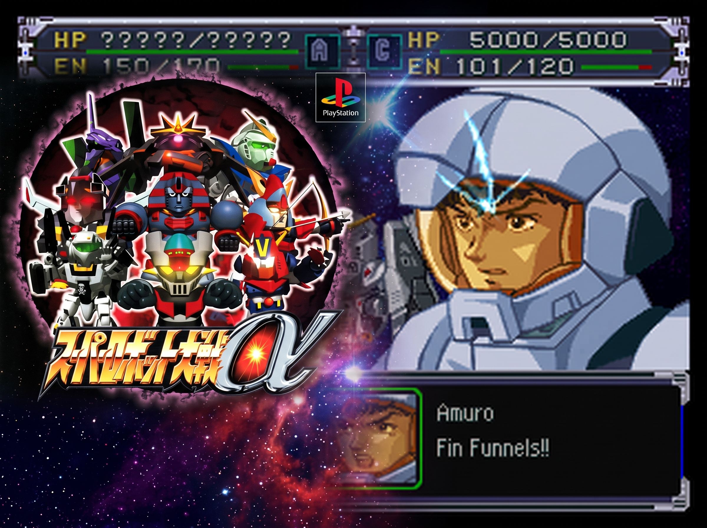
</p>

**Latest release: [Release Candidate 2 (RC02)](https://github.com/Nrlemo/Super-Robot-Wars-Alpha-PSX-English-Ver/releases/tag/RC02)** — fan translation of *Super Robot Taisen Alpha* (PlayStation, 2000) into English.

The first complete, playable English build of **Super Robot Taisen Alpha** (PlayStation, 2000) — the crossover that brought Mazinger, Getter Robo, Gundam (UC and AU), Evangelion, Macross, Dancougar, Dunbine, L-Gaim, Gunbuster, Brain Powerd, the Masou Kishin and the Banpresto originals together for the first time on PSX.

**This is a release candidate**: every line of dialogue is translated and inserted, the game boots and plays in English from the title screen to the battle animations and so forth. Please report anything that looks wrong (see *Reporting problems* below).

### We need your support! 💫

While every line is translated and the game is fully playable from the title screen to the battle animations, we are looking for players to test this build on emulators and physical consoles. 💥

Grab your original Japanese ISO, check the README.md for the quick xdelta patching instructions, and help us polish this masterpiece! Please report any visual bugs🐛, or text issues on our GitHub.

**AND CONSIDER SUPPORTING FURTHER DEVELOPMENT!** 

<a href="https://www.buymeacoffee.com/Srwa_en" target="_blank"></a>

## What is translated

| Content | Status |
|---|---|
| Intermission scenes (`SCRIPT.BIN`, 45,712 lines) | ✅ 100 % |
| Map dialogue (`SNMSG.BIN`, 32,288 messages) | ✅ 100 % |
| Battle quotes (`BXCLIST.BIN`, 18,128 lines) | ✅ 100 %, three style passes |
| Defeat and suspend quotes | ✅ 100 % |
| Pilot names (469), units (486) and weapons (692 names) | ✅ |
| Character and robot dictionaries (350 + 449 entries) | ✅ |
| Menus: title, intermission, status, map, battle, save/load, options, name entry | ✅ |
| Stage titles (128), prologue, terrain and place names, map labels | ✅ |
| Graphics: battle effects, barriers, copyright screen, map location boxes, UI labels | ✅ (most; see known issues) |

**~96,700 lines of dialogue** in total, plus menus and graphics.

**Technical work behind it:** a new English font with a **variable-width font (VWF)** routine patched into the executable (~55 characters per line instead of 20 full-width kana), a raised on-screen text-object limit, re-implemented LZSS compression for the unit/dictionary archives, and a rebuild of the disc image with files allowed to grow.

**Style:** names and attack calls follow the official Western localizations of each series where they exist (Gundam, Evangelion, Macross…), otherwise standard Hepburn. Menu and system terms follow the English *Super Robot Wars OG* releases (*Will*, *Accel*, *Luck*, *Fury*…). A canonical glossary of 1,739 terms keeps names consistent across all files. Each character keeps their voice and verbal tics (Shinobu's *Let's do this!*, Asuka's *You idiot!?*, Masaki's cats' *~nya*…).

## Not translated (by design)

- FMV videos, sound test track names and song lyrics.
- The ending credits (staff names stay as in the original).

## How to apply

You need your own dump of the original Japanese disc. **The patch only works on this exact image:**

| | |
|---|---|
| Game | Super Robot Taisen Alpha (Japan) (v1.0) — SLPS-02636 |
| File | `Super Robot Taisen Alpha (Japan) (v1.0).bin` (single track, 646,374,288 bytes) |
| MD5 | `8cc4b3af159d26d11cad46b136a5c833` |
| SHA-1 | `cfce3c7a76f64269387fbb7b77e3bcfe41b723c6` |

1. Download `SRWAlpha_EN_RC02.xdelta` and `Super.Robot.Taisen.Alpha.English.RC02.cue` from the [Releases page](https://github.com/Nrlemo/Super-Robot-Wars-Alpha-PSX-English-Ver/releases/tag/RC02).
2. Apply the patch to the Japanese `.bin`:
   - **Windows / macOS / Linux (GUI):** [Delta Patcher](https://github.com/marco-calautti/DeltaPatcher) or the [Rom Patcher JS](https://www.marcrobledo.com/RomPatcher.js/) web page.
   - **Command line:**
     ```
     xdelta3 -d -s "Super Robot Taisen Alpha (Japan) (v1.0).bin" SRWAlpha_EN_RC02.xdelta "Super Robot Taisen Alpha (English RC02).bin"
     ```
3. Name the patched file `Super Robot Taisen Alpha (English RC02).bin` (that is the name the `.cue` points to) and keep both in the same folder. You can rename the `.cue` freely; if you rename the `.bin`, edit the `FILE` line of the `.cue` to match.
4. Load the `.cue` in your emulator. Tested with **PCSX-Redux**, **DuckStation** and **RetroArch**. Real hardware / ODE has not been tested yet.

`SHA1SUMS` lists the expected hashes. Patched image: SHA-1 `38e852eb52526c3d48ef3ffb269b2bbbccd609cb`, MD5 `bb79678772db5cf74fe5ed965b656843` (646,442,496 bytes).

> **Memory cards:** saves from the Japanese version load fine, but the protagonist's and partner's names are stored on the card, so they will appear in kana. Start a new game for the English names.

## Known issues

- A few small graphical labels and button icons inside menu strings may sit slightly off (e.g. the triangle icon in the *Counter* menu).
- Digits in dialogue use the fixed 8 px width, so numbers look a bit spaced out.
- A final style read-through (battle quotes per pilot, scenes against the running game) is still to come.

## Reporting problems

Please open an issue with: the scenario number (or the scene), a screenshot, and what you expected. Text cut mid-word, Japanese text left on screen, freezes and wrong names are the most useful reports at this stage.

---

Fan translation, not affiliated with Bandai Namco / Banpresto. No game data is distributed here — only a patch. Please support the official releases.

<a href="https://www.buymeacoffee.com/Srwa_en" target="_blank"></a>

## Screenshots

<p align="center">
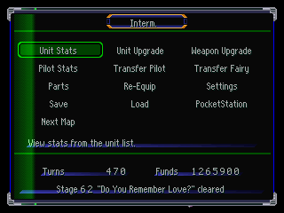
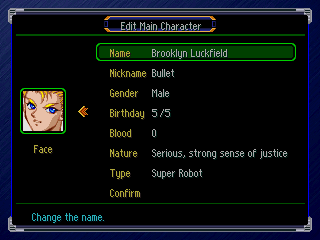
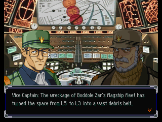
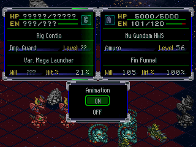
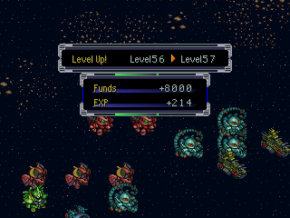
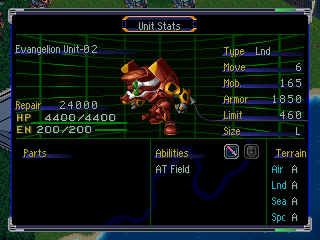
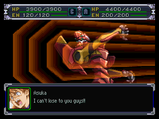
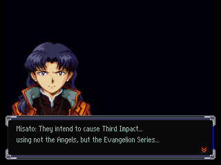
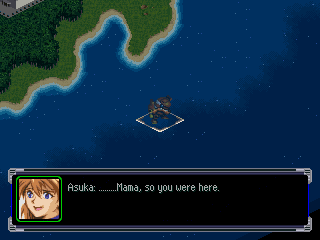
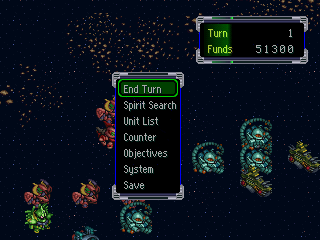
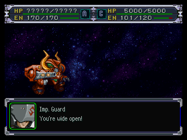
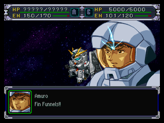
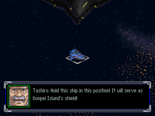
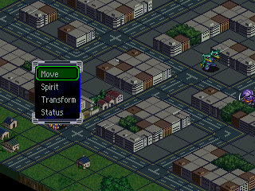
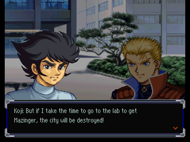
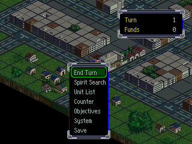
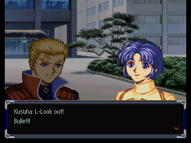
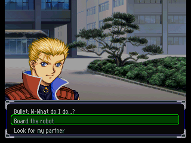
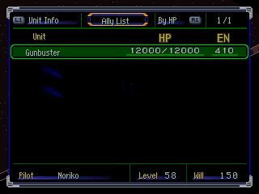
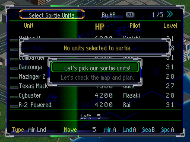
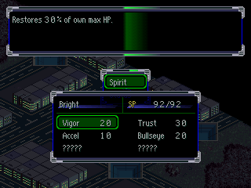
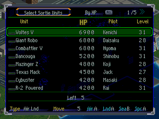
</p>

## Acknowledgments

This project relies on the work of many people. What follows is what we actually used as a source, reference, or tool (`info/`, `Utils/`, `work/notes/`, `work/glossary/`).

### Technical Reference (Romhacking)

| Source | Authors | What we used it for |
|---|---|---|
| **Chinese translation patch "超级机器人ALPHA 汉化 2.0 完全版"** (`Utils/SRT_Alpha`, 2013) | Planning and patch: **WGF** · programming: **KEN TSE**, **luxiwen** · translation: **暴鲤**, **塞外**, **老A** · testing: **parrot0308** | Map of where the text resides, format of the blocks and pointers, and how to reinsert it (Phase 0, see `work/notes/paso1_referencia_chs.md`). Originally distributed at [机战世界 (srworld.net)](http://www.srworld.net/down/game/ps.htm) |
| **Super Robot Wars Alpha Save Data Editor v1.11e** (`Utils/srwalpha_tool111e`) | **Fiigu** | Structure of save data and dictionary/demo lists |

### Game Documentation (`info/`)

| Source | Authors | Link |
|---|---|---|
| Akurasu Wiki (Alpha: characters, units, spirits, skills, OG weapons, timeline, etc.) | Akurasu Community | <https://akurasu.net/wiki/Super_Robot_Wars/Alpha> |
| *Super Robot Taisen Alpha – Character Journal* (GameFAQs) | **Largo** | <https://gamefaqs.gamespot.com/ps/577805-super-robot-taisen-alpha/faqs/8235> |
| *Super Robot Taisen Alpha – Move List* (GameFAQs) | **Chiche** | <https://gamefaqs.gamespot.com/ps/577805-super-robot-taisen-alpha/faqs/73008> |
| *Super Robot Taisen Alpha – Guide and Walkthrough* (GameFAQs) | **Cyath** | <https://gamefaqs.gamespot.com/ps/577805-super-robot-taisen-alpha/faqs> |
| 隠し要素/α — スーパーロボット大戦Wiki (Hidden Elements/α) | srw.wiki.cre.jp Community | <https://srw.wiki.cre.jp/wiki/%E9%9A%A0%E3%81%97%E8%A6%81%E7%B4%A0/%CE%B1> |
| スパロボα 攻略チャート (Super Robot Wars α Walkthrough Chart) (`info/s-rpg-navi.com` folder, ~140 pages) | s-rpg-navi.com | <http://s-rpg-navi.com/> |

### Terminology and Glossary (`work/glossary/`)

Official names and consolidated spellings for each franchise, in addition to Akurasu and SRW Fandom:

- SRW Wiki (Fandom): <https://srw.fandom.com/> · Top Wo Nerae Wiki: <https://topwo.fandom.com/> · Gundam Wiki: <https://gundam.fandom.com/>
- Gundam Official / Gundam.info: <https://en.gundam.info/> · <https://en.gundam-official.com/>
- EvaGeeks (Evangelion): <https://wiki.evageeks.org/>
- Sentai Filmworks (Dunbine): <https://www.sentaifilmworks.com/a/news/sentai-filmworks-summons-aura-battler-dunbine>
- Discotek Media (Giant Robo, Brave Raideen): <https://discotekmedia.com/>
- Official BANDAI NAMCO localizations (*Super Robot Wars 30*, *X*, OG series) on Steam: <https://store.steampowered.com/app/898750/Super_Robot_Wars_30/> · <https://store.steampowered.com/app/1031510/SUPER_ROBOT_WARS_X/>
- Macross 2 (m3): <http://www.macross2.net/m3/m3.html> · TV Tropes: <https://tvtropes.org/> · Wikipedia: <https://en.wikipedia.org/>

### Tools

| Tool | Authors | Link |
|---|---|---|
| PCSX-Redux (debugging and breakpoints) | grumpycoders | <https://github.com/grumpycoders/pcsx-redux> |
| DuckStation (boot testing) | Stenzek | <https://github.com/stenzek/duckstation> |
| mkpsxiso / dumpsxiso (byte-identical ISO rebuild) | Lameguy64 | <https://github.com/Lameguy64/mkpsxiso> |
| armips (MIPS assembler for the VWF patch) | Kingcom | <https://github.com/Kingcom/armips> |
| Ghidra (executable reverse engineering) | NSA | <https://github.com/NationalSecurityAgency/ghidra> |
| ghidra_psx_ldr (PSX loader for Ghidra) | lab313ru | <https://github.com/lab313ru/ghidra_psx_ldr> |
